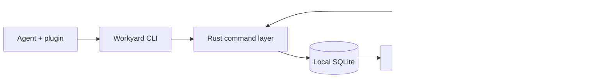

# Workyard architecture

```mermaid
flowchart LR
    Agent[Agent + plugin] --> CLI[Workyard CLI]
    CLI --> Core[Rust command layer]
    Desktop[Tauri desktop] --> Core
    Core --> DB[(Local SQLite)]
    DB --> Events[Append-only events]
    Events --> Desktop
    Events --> Orchestrator[Orchestrator notifications]
```

The CLI and desktop call the same Rust commands. One transaction records each change and its resulting event. The desktop reads events to refresh the board.
